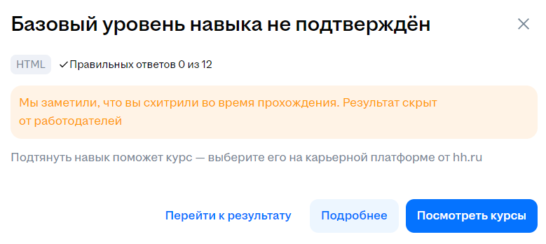
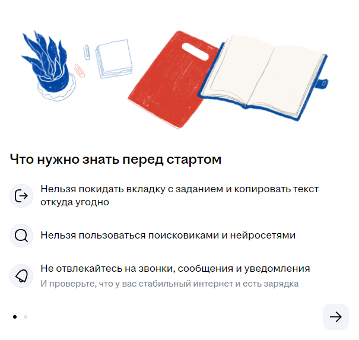
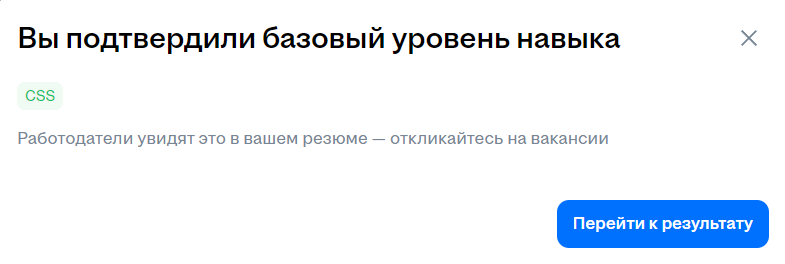
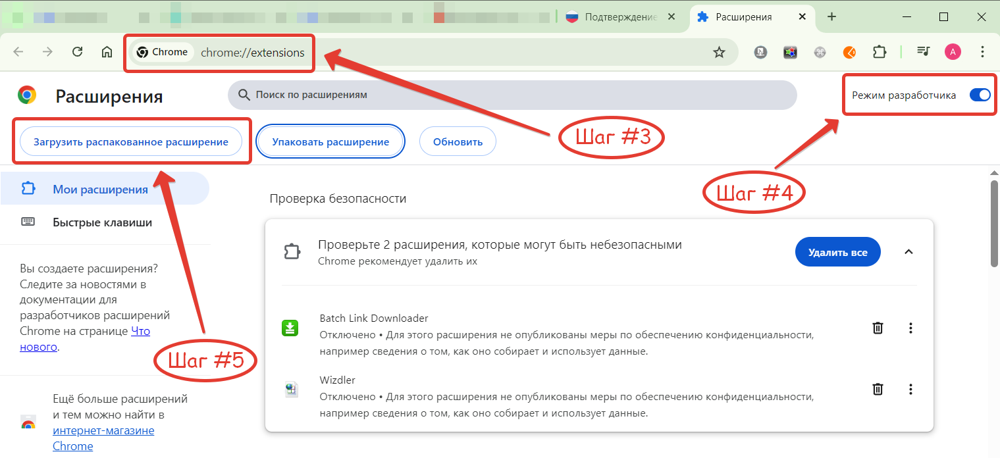

# Gosuslugi and HH.RU Career Hacker: Advanced Tab Tracking Blocker

Расширение для браузеров для обхода ограничений платформы HH.Ru при прохождении тестов на подтверждение IT-компетенций и других тестов.

***Это расширение для браузеров Google Chrome и Mozilla Firefox, которое предотвращает обнаружение веб-сайтами Вашего перемещения по окнам или вкладкам (изменение фокуса вкладок/окон) Вашего браузера. Расширение позволяет пройти тест подтверждения IT-компетенций на HH.Ru с возможностью покидать вкладку с тестом и не быть замеченным в этом нарушении.***

		
Данное решение позволит Вам открыть другую вкладку/окно в браузере, например, с ChatGPT или DeepSeek и пользоваться этими помощниками для получения подсказки или правильного ответа на вопрос в тесте, без угрозы быть уличенным в хитрости.

⚠️ **Внимание:** *Расширение актуально не только для тестов подтверждения IT-компетенций, но и для других тестов на платформе тестирования HH.Ru (маркетинг, копирайтинг и прочих). Кроме того, расширение также будет эффективно против большинства систем отслеживания активности вкладок, включая те, что используются в других онлайн-тестах и системах прокторинга. Однако его эффективность может варьироваться в зависимости от конкретной реализации системы отслеживания. Просто возьмите и попробуйте на конкретной тестовой площадке! Не бойтесь!*

## Официальная страница расширения и связь с автором

👉 Официальная страница расширения: [https://careerhack.hitsecurity.ru/](https://careerhack.hitsecurity.ru/)

👉 Автор (я): Андрей Зиновьев

👉 Связаться с автором (со мной) можно через Telegram: [@DTorretto](https://t.me/DTorretto) или [@Zevs_AV](https://t.me/Zevs_AV)

## Пример работы расширения в браузере Google Chrome

На представленных ниже видео-роликах можно посмотреть пример успешной работы расширения в браузере Google Chrome.

🎥 Ролик на YouTube: [https://www.youtube.com/watch?v=N5uQxNy76Mk](https://www.youtube.com/watch?v=N5uQxNy76Mk)

🎥 Ролик на RuTube: [https://rutube.ru/video/da035a7b988ae96653afccb538fb3631/](https://rutube.ru/video/da035a7b988ae96653afccb538fb3631/)

## Немного о национальной системе подтверждения IT-компетенций

Заинтересованные айтишники уже знают, что в июне 2025 года Минцифры запустило проект по подтверждению своих IT-компетенций и IT-навыков.

Свои навыки теперь можно подтвердить официально и даже получить официальный сертификат. Для этого надо пройти тест на Госуслугах и, в случае успеха, получить сертификат от Минцифры. Это повысит шансы при трудоустройстве, а работодателю даст дополнительный инструмент оценки уровня специалиста.

Мы предполагаем, что в будущем наличие таких сертификатов будет обязательным и необходимым для получения государственных айтишных льгот и преференций.

На платформе «Национальная система подтверждения ИТ-компетенций» можно найти множество тестов по различным IT-направлениям, среди которых разработка, тестирование, знание Linux, умение работать с базами данных и многое другое. Создатели платформы обещают, что со временем на платформу будут добавлены языки программирования C++ и Go и теоретические направления «Математическая статистика» и «Машинное обучение».

Оператором платформы является [HH.Ru](https://hh.ru). Считается, что эти тесты отражают требования рынка, разработаны работодателями совместно с образовательными партнёрами и размещены на [HH.Ru](https://hh.ru). Спорный момент, но будем считать, что так оно и есть.

Более подробная информация и старт тестирования доступны по ссылке [https://www.gosuslugi.ru/itskills](https://www.gosuslugi.ru/itskills)

## Для чего создано это расширение - Хакаем HH.Ru

Дело в том, что на платформе для подтверждения IT-компетенций существуют строгие правила прохождения теста. Если эти правила нарушить, то платформа уличит Вас в хитрости и результат теста не будет засчитан, даже если Вы правильно выполнили все 100% заданий.

И выглядеть это будет примерно так, как на картинке ниже.

После таких хитростей Вам будет предложено пройти тестирование заново, но уже не ранее, чем через месяц.

Существует несколько правил прохождения теста, которые нельзя нарушать, но самым «проблемным» правилом, является вот это правило/требование:

- ***Нельзя покидать вкладку с заданием и копировать текст откуда угодно***

Есть еще важно правило:

- ***Нельзя пользоваться поисковиками и нейросетями***

**НО!** Если мы сможем обойти первое правило *«Нельзя покидать вкладку с заданием и копировать текст откуда угодно»*, то все остальные правила прохождения теста нам перестают быть интересными, так как в данном случае мы сможем без проблем переходить на другие вкладки, а, значит, получаем возможность Google-ить (гуглить), задавать вопросы искусственному интеллекту, запускать код в среде разработке (IDE) и прочее, прочее, прочее.

При этом все эти наши действия, описанные выше останутся незамечеными для платформы тестирования и Вы без проблем сможете пройти тестирование, абсолютно игнорируя правило о том, что *«Нельзя покидать вкладку с заданием и копировать текст откуда угодно»* !

Надеюсь, теперь Вам стало понятно для чего создано это расширение. Если нет, то повторю еще раз...

Это расширение сделано для того, чтобы Вы имели возможность пройти тест на платформе подтверждения IT-компетенций с возможностью без последствий покидать вкладку браузера с запущенным тестом и не быть при этом уличенным в хитрости. Такая возможность неотслеживаемого покидания вкладки с тестом дает Вам возможность Google-ить (гуглить), задавать вопросы искусственному интеллекту, запускать код в среде разработке (IDE) и вообще делать все, что пожелаете нужным.

**В результате Вы без проблем успешно завершите тест и получите заветный сертификат от МинЦифры!**

## :interrobang: FAQ: Как долго будет работать данный хак?

Будем объективны и честны. К сожалению, не могу дать гарантированный ответ на данный вопрос. На текущий момент (июнь 2025 года) расширение успешно работает. Возможно, в будущем, разработчики тестовой платформы прикроют данную лазейку и/или изобретут другие способы защиты от хитростей. Но, повторюсь, на данный момент расширение успешно работает!

Если Вы заметите, что расширение перестало работать или работает "как-то не так", то прошу Вас написать об этом мне в Telegram на [@DTorretto](https://t.me/DTorretto) или на [@Zevs_AV](https://t.me/Zevs_AV) и максимально подробно описать проблему, желательно с приложением скриншотов и/или видеозаписи. В свою очередь мы постараемся оперативно решить эту проблему. А если разработчики платформы тестирования придумают другие способы защиты, то мы постараемся найти оптимальное решение и обойти их.

## :interrobang: FAQ: Расширение предназначено только для тестов на HH.Ru?

Конечно же, нет! Несмотря на то, что это расширение разрабатывалось именно для прохождения тестов на платформе «Национальная система подтверждения ИТ-компетенций» на площадке HH.Ru, оно эффективно против большинства систем отслеживания активности вкладок, включая те, что используются в различных онлайн-тестах и системах прокторинга.

Просто попробуйте и убедитесь в этом сами.

## Установка расширения в Google Chrome

1. Создайте на жестком диске (кто побогаче - на SSD и круче) папку для установки расширения. Например, папку ***E:\CareerHacker_Chrome***.
2. Скачайте архив со свежей версией расширения и поместите все файлы из скачанного архива в папку, созданную на предыдущем шаге.
3. Запустите браузер Google Chrome и перейдите на страницу ***chrome://extensions/***.

4. На открывшейся странице включите ***Режим разработчика***.
5. Нажмите кнопку ***Загрузить распакованное расширение***.
6. В открывшемся окне выберите вашу папку, созданную на первом шаге.

**Все готово! Расширение установлено!**

**Внимание:** После установки расширения ранее созданную папку **НЕ УДАЛЯТЬ!**

## Установка расширения в Mozilla Firefox

1. Создайте на жестком диске (кто побогаче - на SSD и круче) папку для установки расширения. Например, папку ***E:\CareerHacker_Firefox***.
2. Скачайте архив со свежей версией расширения и поместите скачанный ZIP-архив с расширением в папку, созданную на предыдущем шаге. Архив распаковывать не надо!
3. Запустите браузер Mozilla Firefox и перейдите на страницу ***about:debugging***.
4. На открывшейся странице выберите ***This Firefox*** (***Этот Firefox***) → ***Load Temporary Add-on...*** (***Загрузить временное дополнение...***)
5. В открывшемся окне выберите Ваш ZIP-архив с расширением, который Вы положили в папку, созданную на первом шаге.

**Все готово! Расширение установлено!**

**Внимание:** После установки расширения ранее созданную папку **НЕ УДАЛЯТЬ!**

## Как это все работает (для любопытных)

Чтобы предотвратить обнаружение смены вкладок (окон) или сворачивания браузера, нужно переопределять ключевые JavaScript-события и свойства. И вот что мы делаем:

- ✅ Переопределяем Page Visibility API (делаем полнаю маскировку):
	- ✅ Заставляем document.hidden всегда возвращать false
	- ✅ Теперь document.visibilityState всегда возвращает 'visible'
	- ✅ Поддерживаем стандартные и префиксные версии (moz, webkit, ms)
	- ✅ Блокируем все известные способы определения видимости	

- ✅ Делаем блокировку событий:
	- ✅ Перехватываем события focus, blur и visibilitychange до того, как они достигнут кода сайта с тестами
	- ✅ Модифицируем addEventListener чтобы игнорировать подписки на эти события

- ✅ Защищаемся от интервальных проверок:
	- ✅ Анализируем функции, передаваемые в setInterval
	- ✅ Блокируем частые проверки (интервалы ≤ 2 секунд) и проверки, содержащие ключевые слова

- ✅ Раннее выполнение (внедрение):
	- ✅ Скрипт запускается до загрузки страницы (document_start), поэтому успевает переопределить API до их использования платформой тестирования
	
- ✅ Безопасность
	- ✅ Расширение использует только необходимые разрешения и работает в sandbox (в песочнице).

- ***В версии 1.1 реализованы следующие улучшения:***

- ✅ Расширенный перехват свойств:
	- ✅ Добавлены все варианты: webkitHidden, msHidden и др.
	- ✅ Блокировка requestIdleCallback

- ✅ Глубокая обработка iframe:
	- ✅ Отдельный скрипт inject.js для обработки вложенных фреймов
	- ✅ Автоматическая инъекция во все фреймы
	- ✅ Блокировка Service Workers

- ✅ Блокировка tracking-скриптов:
	- ✅ Автоматическая отмена загрузки известных скриптов аналитики

- ✅ Защита от обхода:
	- ✅ Перехват всех видов таймеров (setInterval, setTimeout)
	- ✅ Блокировка requestIdleCallback
	- ✅ Защита performance API

- ✅ Периодическое обновление защиты:
	- ✅ Динамическая повторная инъекция для SPA и динамических страниц
	- ✅ Автоматическое обновление защиты при смене URL
	- ✅ Улучшенная обработка событий: блокировка focusin/focusout, перехват pageshow/pagehide
	- ✅ Периодическая проверка состояния

- ✅ Специфичные улучшения для Firefox:
	- ✅ Обработка moz-префиксных событий и свойств
	- ✅ Оптимизация для движка Gecko

	
## :interrobang: Как купить расширение Career Hacker

А никак! 😉 **Данное расширение распространяется абсолютно бесплатно!** Пользуйтесь на здоровье!

Однако, мной было потрачено некоторое личное время на разработку этого расширения и этой маргинальной странички для него. Поэтому у Вас есть возможность финансово отблагодарить автора сего расширения, то есть меня, за проделанную работу и задонатить ему некоторую сумму 😉. Буду премного благодарен. Конечно же, у Вас есть такое желание...

Задонатить автору можно на официальной странице расширения: [https://careerhack.hitsecurity.ru/](https://careerhack.hitsecurity.ru/)

## :interrobang: FAQ: Какие гарантии, что это не обман, не вирус и расширение действительно работает?

Это не обман! Как говорилось ранее, на текущий момент (июнь 2025 года) расширение успешно работает. Возможно, в будущем, разработчики тестовой платформы прикроют данную лазейку, и таким образом текущая версия расширения перестанет работать или изобретут другие способы защиты от хитростей. Если вдруг расширение перестанет работать, то мы будем искать способы исправить эту проблему.

Расширение не содержит никакого вредоносного кода. Исходники расширения открыты и Вы можете сами в этом убедиться.

## :interrobang: FAQ: Что делать, если расширение перестанет работать после обновления платформы тестирования?

Такое не исключено. Возможно, в будущем, разработчики тестовой платформы прикроют данную лазейку, и таким образом текущая версия расширения перестанет работать или изобретут другие способы защиты от хитростей. Если такое произойдет, то мы будем искать другие способы обхода ограничений платформы и при необходимости выпустим обновление расширения.

## :interrobang: FAQ: Можно ли использовать это расширение для других платформ (тестов), кроме HH.Ru?

Конечно же, ДА! Расширение эффективно против большинства систем отслеживания активности вкладок, включая те, что используются в различных онлайн-тестах и системах прокторинга. Однако его эффективность может варьироваться в зависимости от конкретной реализации системы отслеживания.

Просто возьмите и попробуйте! Не бойтесь!

## :interrobang: FAQ: Мне помог Career Hacker, и я хочу отблагодарить автора материально. Как это сделать?

Я был бы благодарен Вам, сэр за это! 😉

Данное расширение распространяется абсолютно бесплатно!

Однако, мной было потрачено некоторое личное время на разработку этого расширения и этой странички для него. Поэтому у Вас есть возможность финансово отблагодарить автора сего расширения, то есть меня, за проделанную работу и задонатить ему некоторую сумму 😉. Буду благодарен. Конечно же, у Вас есть такое желание...

Задонатить автору можно на официальной странице расширения: [https://careerhack.hitsecurity.ru/](https://careerhack.hitsecurity.ru/)

----
© 2025 Gosuslugi and HH.RU Career Hacker: Advanced Tab Tracking Blocker Browser Extension. Все права защищены.
© 2025 Andrey Zinoviev in Telegram [@DTorretto](https://t.me/DTorretto) aka [@Zevs_AV](https://t.me/Zevs_AV), E-Mail: avzevs@gmail.com. Все права защищены.
